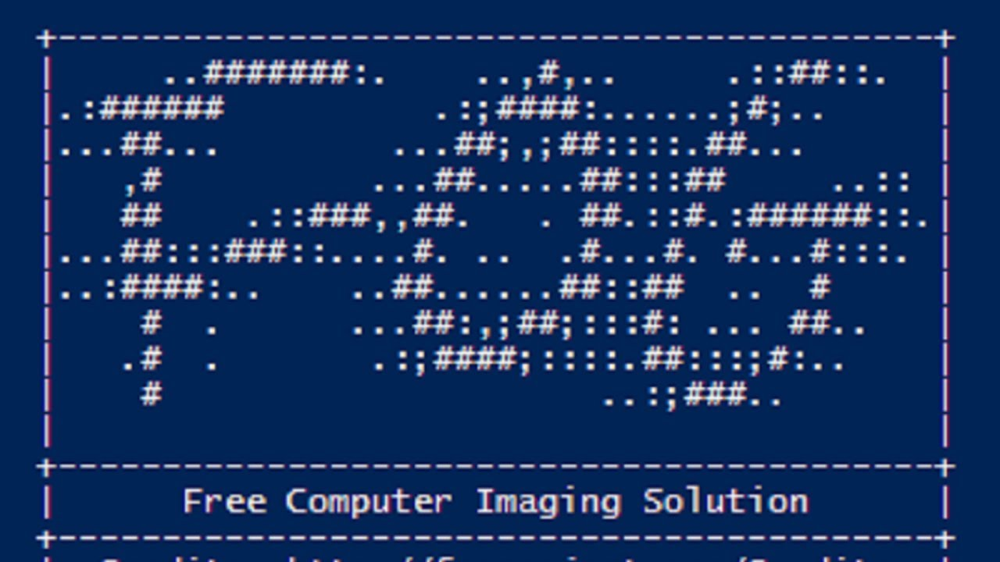

## SunSSC F.O.G. PXE Deployment Guide
### Using F.O.G. (Free Open-source Ghost)

PXE (pronounced like “pixie”) all generally work by loading a small O.S. over the network into RAM and booting into it. WDS loads Windows PE (pre-environment) and FOG loads a small Linux image.

### Windows 10 Installation (no USB flash drive needed)
_Estimated time from start to installation finished: two to five minutes_

1. Required BIOS settings:
   1. Under the "System Configuration" section:
   
      1. **Integrated NIC**
	     1. [Checked] Enable UEFI Network Stack
		 2. Enabled w/ PXE
		 
      2. **SATA Operation**
	     1. AHCI
		 
	  3. *You need to restart and re-enter BIOS if UEFI Network Stack was previously disabled*
	  
   2. Under the "General" section:
   
      1. **Boot Sequence**
	     1. On the rightmost column, "Onboard NIC (IPv4)" is at the TOP
		 
   3. Under the "Secure Boot" section:
   
      1. **Secure Boot Enable**
	     1. [Unchecked] Enable
		 
2. Apply & exit. Computer will restart

3. When the FOG menu shows up:
   1. Select **"Deploy Image"**
   
   2. Enter IT credentials
   
   3. Select **'W10_Pro_UEFI_SYSPREPPED (2)'**
   
4. FOG will use partclone to reformat the drive, deploy the sysprepped W10 Pro image, and expand the correct partition to fill the drive. This takes roughly two minutes on an m.2 NVMe ssd.

5. You are finished. Computer will restart once or twice after installation. It will have the correct admin password, time zone, be registered on FOGserver, and have the correct security question answers.

#### Post-Installation Steps
- Change hostname and join the correct domain (shortcut to "system": Win + Pause)

- Update asset management system

- PDQ will install necessary programs for each company (work in progress)

## [Video of a image/software deployment in action](https://web.microsoftstream.com/video/e0257dac-b739-4541-8de1-fa4f72231292)
## [How to capture a disk](./capture.md)

_Written June 2nd, 2020 by DK_

_Updated September 22nd, 2020_
